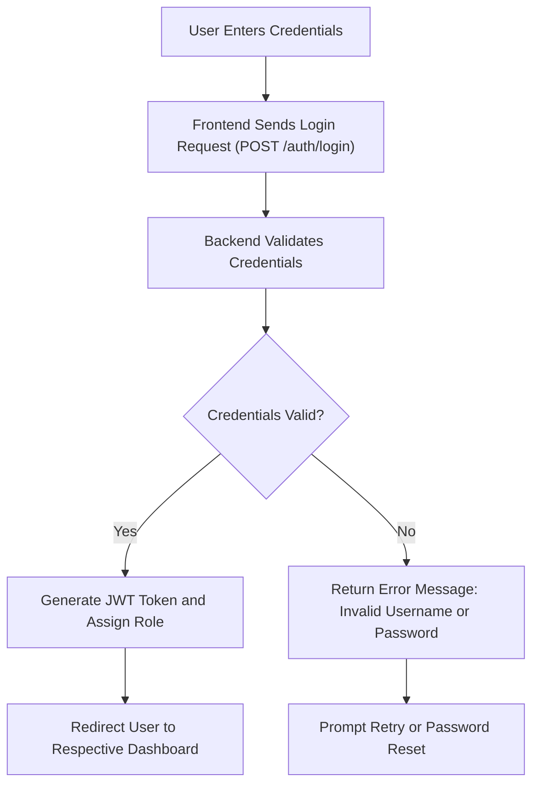
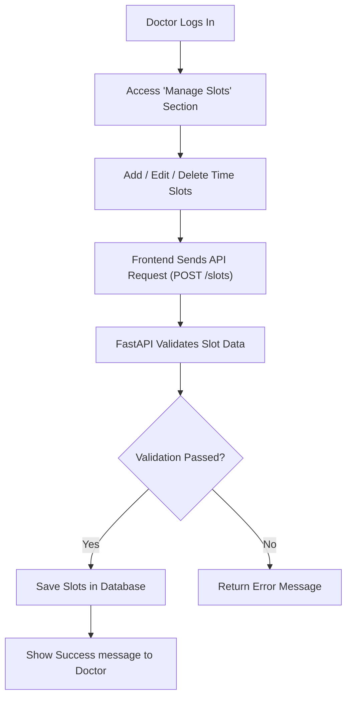
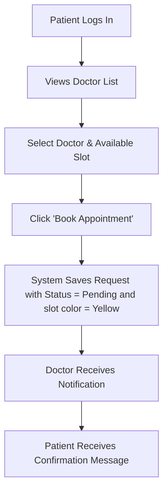
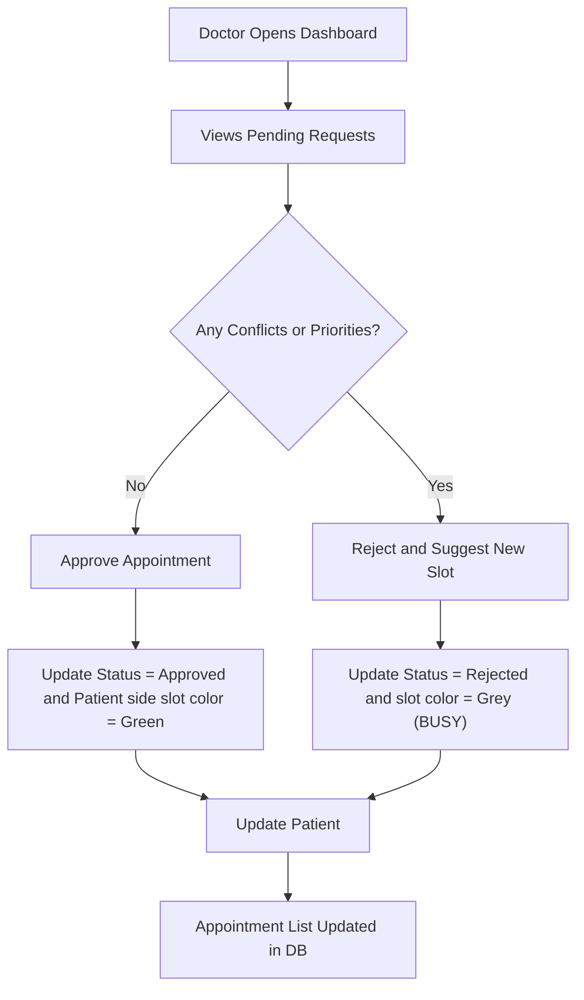
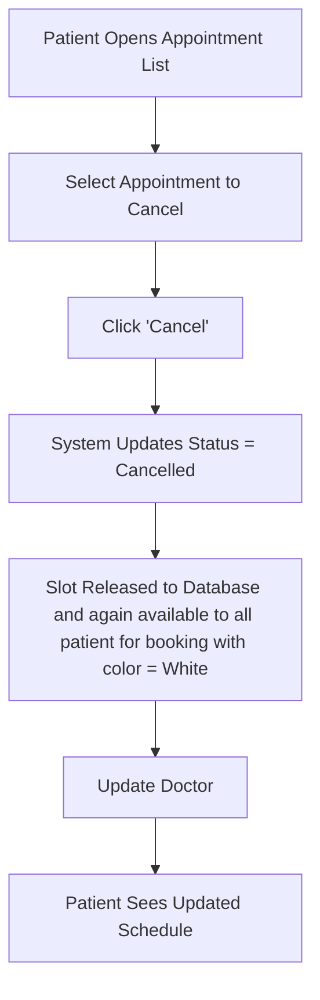

# **Functional Use Cases**
This section outlines the functional use cases of the MediLink Appointment System, describing how system components interact to fulfill business objectives through technical features and workflows.
Each use case focuses on the system behavior, triggered by user actions and handled via the backend (FastAPI + PostgreSQL) and frontend (React / PWA).
## **1. Functional Context**
MediLink’s functional layer is responsible for implementing the digital workflows that allow doctors, patients, and administrators to interact seamlessly.
Each function from appointment scheduling to data validation is automated to ensure accuracy, security, and real-time synchronization across users.
## **2. Functional Use Case Summary**
| **Use Case ID** | **Use Case Name** | **Primary Actor(s)** | **Goal / Description** | **Expected Outcome** |
|------------------|-------------------|------------------------|--------------------------|----------------------|
| **FUC-01** | User Authentication | Admin, Doctor, Patient | Secure login and registration through JWT-based authentication. | Access granted after validation. |
| **FUC-02** | Manage Doctor Records | Admin | Add, update, or delete doctor information in the database. | Records updated successfully. |
| **FUC-03** | Manage Appointment Slots | Doctor | Create or edit time slots for patient booking. | Slots stored and visible to patients. |
| **FUC-04** | Book Appointment | Patient | Select a doctor and time slot to request an appointment. | Request saved as “Pending.” |
| **FUC-05** | Approve/Reject Appointment | Doctor | Approve, reject, or reschedule patient requests. | Appointment status updated. |
| **FUC-06** | Cancel Appointment | Patient | Cancel previously booked appointments. | Slot becomes available again. |
| **FUC-07** | Logout | All Users | End active session securely. | Session terminated, user redirected to login. |

## **3. FUC-01 – User Authentication**
**Description**
Ensures that only verified users can access MediLink using secure credentials.
The system uses JWT tokens for session management and role-based access control.

### **Alternate Flow / Error Handling**

| **Failure Type** | **System Response** | **User Message** |
|------------------|--------------------|------------------|
| Invalid credentials | HTTP 401 returned | “Invalid username or password.” |
| Token expired | Token refresh triggered | “Session expired. Please log in again.” |
| Network failure | Frontend retry logic triggered | “Network issue. Try again later.” |

## **4. FUC-03 – Manage Appointment Slots (Doctor)**
**Description**
Allows doctors to define their available consultation slots, which patients can later view and book.

### **Validation Rules:**

- No overlapping slots allowed.
- Slot date/time must be valid (future).
- Slots linked to the logged-in doctor’s ID.

## **5. FUC-04 – Book Appointment (Patient)**
**Description**
Patient selects an available slot and submits an appointment request.
The system stores it as “Pending” until reviewed by the doctor.

### **Slot Visualization and Booking Behavior**

To ensure a smooth, conflict-free appointment booking process, the MediLink system implements a color-coded slot visualization mechanism.  
Each color represents a distinct slot status and dynamically changes based on user and system actions.

| **Color** | **Slot Status** | **Description / System Behavior** |
|------------|----------------|-----------------------------------|
| ⚪ White | Available | Slot is open for booking and visible to all patients. |
| 🟡 Yellow | Pending | Slot has been booked by a patient but is awaiting doctor approval. |
| 🟢 Green | Confirmed | Appointment has been approved by the doctor. |
| ⚫ Grey | Doctor Busy / Rejected | Slot becomes unavailable because the doctor rejected the request or marked themselves busy. |

**Behavioral Rules:**

1. When a slot is created, it appears **White (Available)** to all patients.  
2. Once a patient books a slot, it turns **Yellow (Pending)** and become disable to all patients.  
3. If the doctor **approves** the appointment, the slot turns **Green (Confirmed)**.  
4. If the doctor **rejects** the appointment, the slot turns **Grey (Busy)**.  
5. If the **patient cancels** a booked appointment, the slot automatically reverts to **White (Available)** and becomes available to all patients again.  
6. When a doctor marks themselves as **Busy**, all related slots appear **Grey (Busy)** and are temporarily disabled for booking.  
7. If a slot remains **unapproved within 30 minutes of the scheduled time**, the system automatically suggests alternative available slots or doctors to the patient.

This approach ensures clear communication of slot status, prevents double booking, and maintains transparency for both patients and doctors.

### **Error Handling**

| **Failure Case** | **System Action** | **Message Displayed** |
|------------------|------------------|------------------------|
| Slot already booked | Backend rejects request | “Slot unavailable, please choose another time.” |
| Invalid input | Validation fails | “Invalid details. Please retry.” |
| Network issue | Retry or fail-safe | “Network error. Please try again later.” |

## **6. FUC-05 – Approve/Reject Appointment (Doctor)**
**Description**
Doctors review incoming requests and either approve, reject, or suggest new timings.

## **7. FUC-06 – Cancel Appointment (Patient)**
**Description**
Patient cancels a scheduled appointment before consultation.

## **8. Summary**
MediLink’s functional use cases provide the backbone of the system, enabling smooth user system interactions through secure, validated, and automated processes.
Each function directly supports a corresponding business use case, ensuring that operational goals such as improved efficiency, reduced workload, and better patient satisfaction are achieved through reliable technical execution.