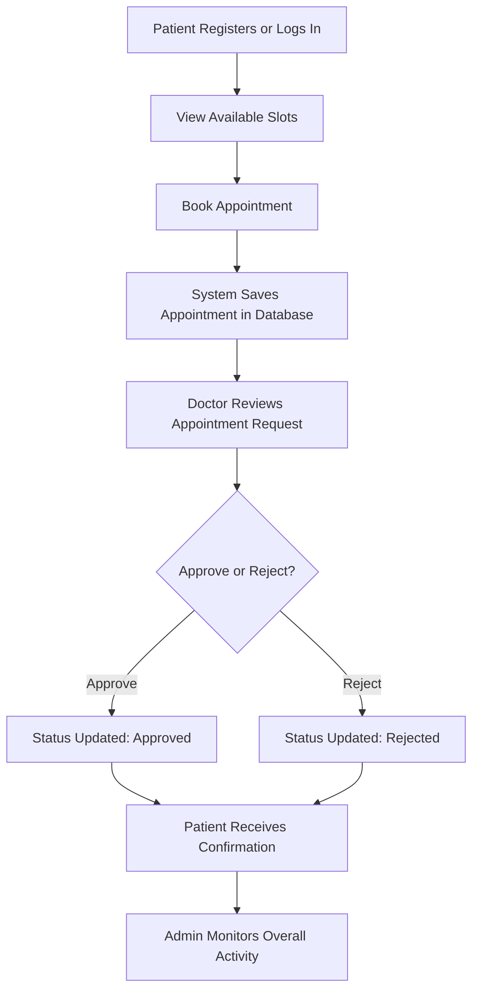

# **Functional Documentation**

## **1. Introduction**

The **MediLink Appointment Management System** is a digital platform developed for clinics or individual doctors to manage appointments efficiently.  
It connects **Admins**, **Doctors**, and **Patients** within a unified system, automating tasks such as booking, slot management, and appointment tracking.

This system replaces traditional manual scheduling with a modern web-based and mobile-compatible **Progressive Web Application (PWA)**.  
By integrating **FastAPI** for backend logic and **PostgreSQL** for secure data storage, MediLink ensures high performance, consistency, and scalability.

## **2. Project Background**

In many small and medium-sized clinics, appointments are managed manually through phone calls or written registers.  
This process often leads to:

- Double bookings and scheduling conflicts.  
- Delays in communication between patients and doctors.  
- Lack of real-time slot availability.  
- Paper-based data storage prone to errors and data loss.  

To overcome these challenges, **MediLink** introduces a **digital transformation of clinic operations**.  
It automates appointment booking, provides real-time updates, and offers remote access for patients through a secure and responsive platform.

## **3. Objective**

The primary objective of **MediLink** is to develop a **secure, efficient, and user-friendly appointment system** that:

- Allows **patients** to register, log in, and manage appointments digitally.  
- Enables **doctors** to define availability, view requests, and approve or reject bookings.  
- Provides **admins** with oversight of the system and the ability to manage doctor data and monitor performance.

This ensures transparency, reduces manual workload, and prevents scheduling errors through automation.

## **4. Core Modules**

| **Module** | **Description** |
|-------------|-----------------|
| **Admin Module** | The Admin handles doctor details and data consistency. |
| **Doctor Module** | The Doctor defines available slots, views booking requests, and approves or rejects them based on availability. |
| **Patient Module** | Patients can register, log in, book or cancel appointments, and check appointment status via PWA. |
| **Database Module** | Manages structured storage for users, appointments, and slot data using PostgreSQL. |
| **API Module** | Developed with FastAPI to handle authentication, booking, and communication between frontend and backend. |
| **PWA Module** | Provides mobile-friendly access, installable features, and limited offline capabilities. |

## **5. Project Workflow**

### **Workflow Explanation**
- **Patient Registration:** Patients create an account or log in to the system.
- **Slot Management:** Doctors create and update available consultation slots.
- **Booking Process:** Patients select a preferred slot and submit a booking request.
- **Approval Process:** Doctor reviews and approves or rejects the request.
- **Admin Monitoring:** Admin oversees system activity and ensures smooth operation.

# Technologies Used

| Category | Technologies |
|-----------|--------------|
| Frontend | HTML5, CSS3, JavaScript, Bootstrap |
| Backend | Python (FastAPI) |
| Database | PostgreSQL |
| Database Tool | DBeaver |
| Authentication | JWT |
| Version Control | Git, GitHub |
| Documentation | MkDocs Material |

## System Functionalities

| **Functionality** | **Description** |
|--------------------|-----------------|
| User Authentication | Secure login and role-based access using JWT/OAuth2. |
| Appointment Management | Book, update, or cancel appointments. |
| Database Management | PostgreSQL used for storing all relational data securely. |

## Limitations

| **Category** | **Description** |
|---------------|-----------------|
| **Payment System** | No integrated online payment feature in the current version. |
| **Multi-Clinic Support** | Currently supports a single clinic setup only. |
| **Offline Access** | Requires an active internet connection to access features. |
| **Real-Time Chat** | No direct messaging or live consultation feature between doctor and patient. |
| **AI Recommendation** | Lacks intelligent doctor or time-slot recommendations (future plan). |

## Benefits

| **Aspect** | **Benefit** |
|-------------|-------------|
| **Automation** | Reduces manual work of managing appointments and records. |
| **Accessibility** | Patients can book and manage appointments from anywhere. |
| **Transparency** | Doctors and patients can view real-time appointment status. |
| **Security** | Role-based access control and encrypted data storage. |
| **Efficiency** | Streamlined workflows reduce waiting times and errors. |

## Future Scope

| **Feature** | **Description** |
|--------------|-----------------|
| **Payment Gateway Integration** | Add online consultation fees and automated billing using Razorpay/Stripe. |
| **Teleconsultation (Video Call)** | Integrate online video meetings between doctors and patients. |
| **AI-Based Appointment Recommendation** | Suggest best available time slots or doctors using AI models. |
| **Chatbot Support** | Use Amazon Lex or Dialogflow to assist patients with queries and booking. |
| **Analytics Dashboard** | Generate detailed insights for admin — patient trends, peak timings, etc. |
| **Multi-Clinic System** | Enable multiple doctors or clinics under one platform. |
| **IoT / Smart Health Integration** | Connect wearable devices for health data syncing. |
| **Voice-Enabled Booking** | Allow patients to book via voice commands or IVR system. |

## **7. Summary**
The MediLink Functional Description outlines how the system operates at a high level connecting Admins, Doctors, and Patients through a single digital interface.
It describes the system’s workflow, architecture, and functionality:

- Automation of clinic operations
- Secure data management with PostgreSQL
- Efficient communication using FastAPI
- Mobile accessibility via PWA

MediLink delivers a comprehensive, scalable, and modern solution for digital appointment management designed to enhance efficiency, reduce manual workload, and improve patient experience.