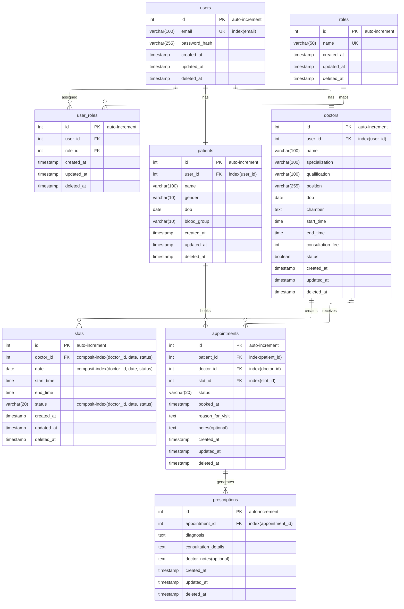

# Schema Design and Indexing

## Schema Design 

## Indexing Table

| **Table Name**   | **Indexed Column(s)**                     | **Reason for Indexing**                                         | **Use Case** |
|------------------|-------------------------------------------|-----------------------------------------------------------------|--------------|
| **users**        | `email`                                   | Ensures unique user login and fast authentication lookups.      | Validate login credentials instantly using `email`. |
| **patients**     | `user_id`                                 | Quickly fetches patient details linked to their user account.   | Retrieve patient profile after successful login. |
| **doctors**      | `user_id`                                 | Improves access speed to doctor profiles tied to user records.  | Load doctor profile on dashboard initialization. |
| **slots**        | `(doctor_id, date, status)` *(Composite)*  | Enhances slot availability checks and prevents redundant scans. | Display all available slots for a specific doctor and date. |
| **appointments** | `patient_id`                              | Speeds up patient appointment history retrieval.                | Show patient’s past and upcoming appointments. |
| **appointments** | `doctor_id`                               | Optimizes doctor’s appointment list queries.                    | Doctor views all scheduled appointments efficiently. |
| **appointments** | `slot_id`                                 | Prevents double-booking and maintains data integrity.           | Ensure only one booking per slot. |
| **prescriptions**| `appointment_id`                          | Enables fast fetching of prescriptions linked to appointments.  | View prescription details post-appointment. |

