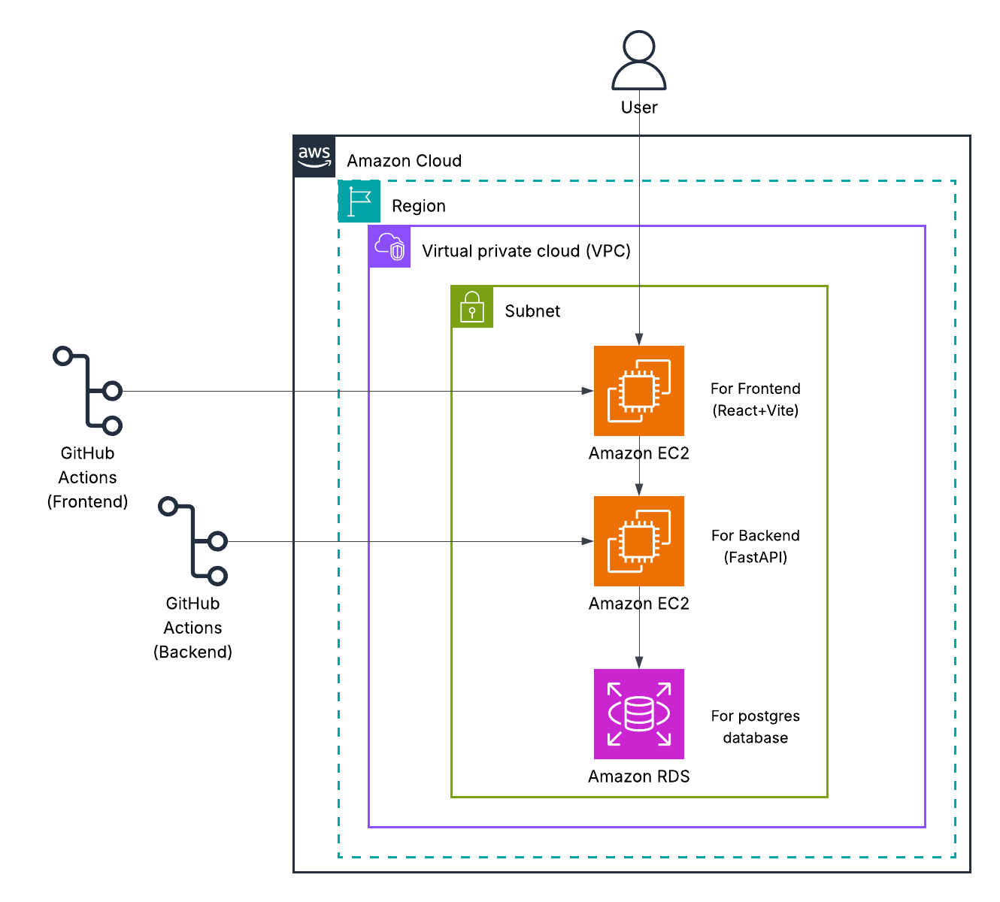

# Technical Part of MediLink

## Architecture diagram (AWS specific)
The AWS architecture of **MediLink** demonstrates how the platform is securely deployed and managed within the AWS cloud ecosystem.  

When a **Patient or Doctor** accesses the MediLink frontend, their HTTP requests are routed through the AWS infrastructure, hosted within a **Virtual Private Cloud (VPC)** for isolation and security.  

- **Amazon EC2 (Elastic Compute Cloud):** Hosts the MediLink backend (FastAPI application) and serves incoming HTTP requests from users.  
- **Amazon RDS (Relational Database Service):** Stores all MediLink data, including user accounts, doctor details, appointment records, and slot information, ensuring reliability and automatic backups.  
- **Amazon CloudWatch:** Monitors system performance, logs API activity, and provides real-time insights into server health and database metrics.  

This architecture ensures **scalability, security, and continuous monitoring**, enabling MediLink to deliver a reliable healthcare service experience for both patients and doctors.

