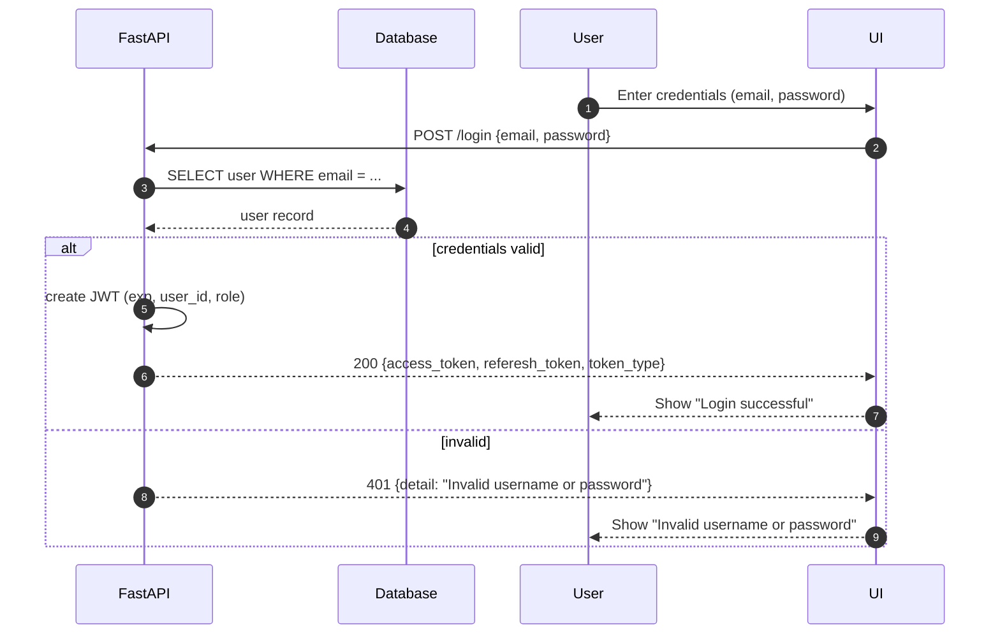

# Authentication and Authorization Explanation
The **Authentication and Authorization** module in MediLink is responsible for verifying user identities and managing secure access across different roles **patients**, **doctors**, and **admins**.  

During login, users provide their credentials (email and password), which are verified against the database. Upon successful validation, the backend (FastAPI) generates a **JWT (JSON Web Token)** containing user details such as `user_id`, `role`, and token expiration time. This token is then returned to the client and stored securely (e.g., in session or local storage).  

The token is used to authenticate subsequent API requests, ensuring that only authorized users can perform specific actions:

- **Patients** can book or cancel appointments.  
- **Doctors** can manage slots and approve or reject appointments.  
- **Admins** can manage doctor profiles and monitor system data.  

If invalid credentials are provided, the system returns an **HTTP 401 Unauthorized** response, preventing access. JWT-based authentication ensures a stateless and secure communication process between the frontend and backend, maintaining data privacy and integrity throughout MediLink’s workflow.

