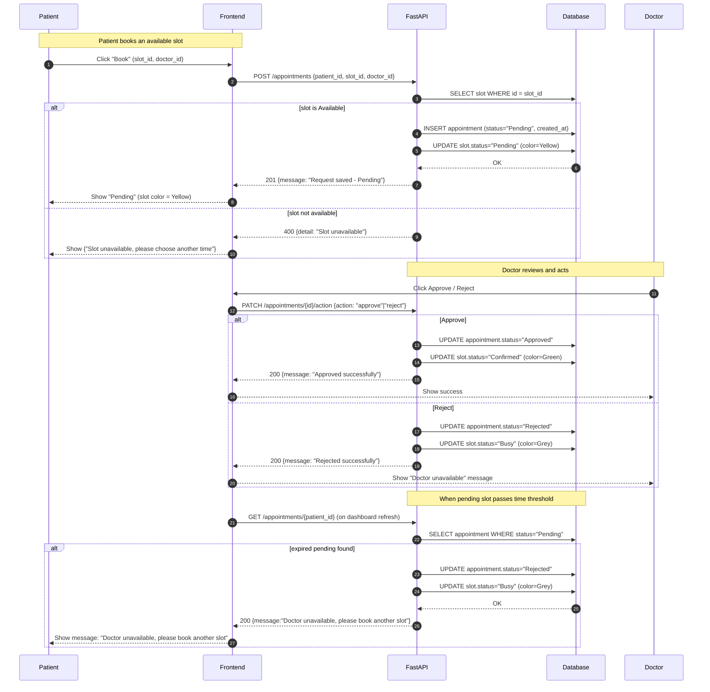

# Appointment Booking → Approve / Reject → Expiry / Auto-cancel
This module manages the complete appointment lifecycle between **patients** and **doctors** in the MediLink system. It ensures that every booking request follows a consistent flow, maintaining slot integrity and time accuracy.

When a patient books an available slot, the appointment status is initially set to **"Pending"**. The respective doctor then reviews the request and either **approves** or **rejects** it based on availability or priority tasks.  

- **Approved appointments** automatically mark the slot as **"Confirmed" (Green)**, ensuring no other bookings can occur during that time.  
- **Rejected appointments** mark the slot as **"Busy" (Grey)**, indicating that the doctor is unavailable for that period.  
- **Auto-cancel/Expiry** logic ensures that if a pending request remains unacted upon beyond its threshold time, the system automatically **rejects** the appointment and frees up the slot, prompting the patient to choose another available time.  

This automation reduces manual overhead for doctors and ensures real-time updates in the appointment dashboard for both parties. It also prevents overlapping or stale bookings, maintaining accuracy and transparency in scheduling.

