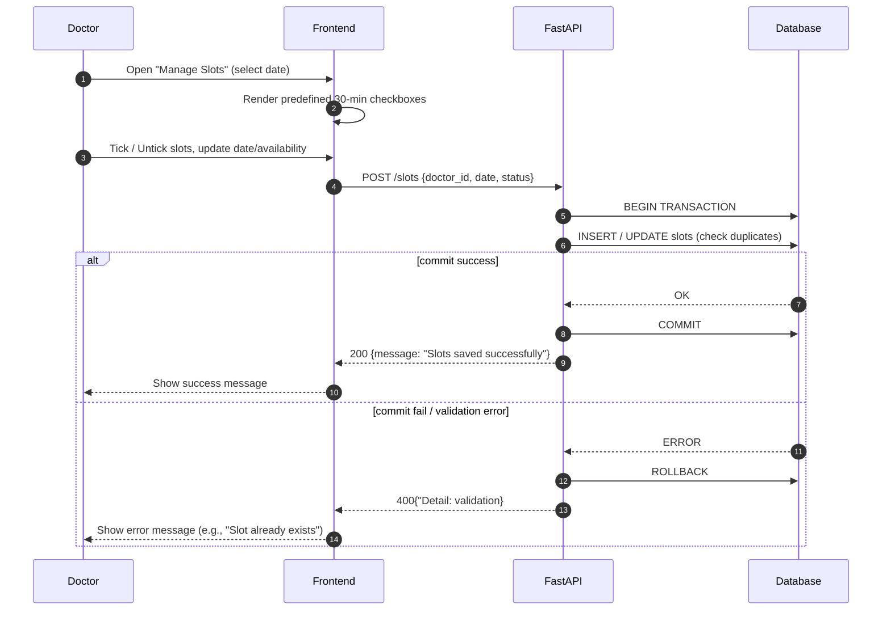

# Doctor slot management (pre defined slots)
The **Doctor Slot Management** module allows doctors to create, update, or remove their consultation availability using a **predefined slot system**. Each slot represents a fixed consultation duration (e.g., 30 minutes), ensuring uniform scheduling and better time management.

When a doctor accesses the **"Manage Slots"** section, they can select a specific date and tick or untick predefined time intervals to mark their availability. The frontend dynamically renders these slots as checkboxes for easy interaction.  

Upon submission, the selected slots are sent to the backend API (`POST /slots`), which performs validation checks such as preventing duplicate entries or overlapping time ranges before committing them to the database.  

If the operation is successful, the system confirms with a **“Slots saved successfully”** message. In case of validation errors (e.g., slot already exists), the system triggers a rollback and returns an error message to the doctor.

This module ensures:

- Streamlined management of doctor availability  
- Prevention of overlapping slots  
- Real-time synchronization between doctor schedules and patient booking views  

By maintaining slot integrity, MediLink guarantees efficient scheduling and a smooth appointment workflow.

