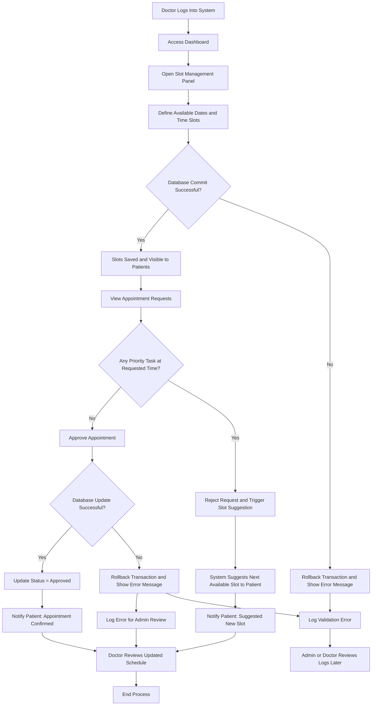

# **Business Use Cases**

This section defines the business-level use cases of the MediLink Appointment System.  
These use cases describe how each stakeholder (Admin, Doctor, and Patient) interacts with the system to fulfill their operational objectives and contribute to efficient clinic management.

## **1. Business Context**

MediLink simplifies clinic operations by connecting doctors, patients, and system administrators through a single digital platform.  
It replaces manual appointment handling with an automated and transparent workflow, improving efficiency, accuracy, and patient satisfaction.

## **2. Business Use Case Summary**

| Role | Business Objective | Description | Value to Business |
|-------|--------------------|--------------|-------------------|
| Admin | Manage system setup | Handles doctor registration and database maintenance | Ensures smooth operations |
| Doctor | Manage clinic appointments | Creates slots, reviews requests, and manages appointments | Saves time and improves scheduling |
| Patient | Book and manage appointments | Registers, books, or cancels appointments online | Provides flexibility and convenience |

## **Business Rules**

1. Each appointment must be associated with one registered doctor and one registered patient.
2. A doctor cannot approve overlapping appointments.
3. Appointment cancellation is allowed only before the scheduled time.
4. Only admins can modify or delete doctor records.
5. A patient can book appointments only for time slots that are at least 1 hour ahead of the current time.

## **3. Admin Business Use Case**

### **Use Case: Manage Doctor Data**
**Goal:** Admin maintains doctor records.  
**Trigger:** Admin logs into the admin dashboard.  
**Outcome:** Data updated securely in the database.

#### **Failure Handling in Admin Workflow**

The following table describes the possible failure scenarios during Admin operations and how the MediLink system handles them to ensure data consistency and reliability.

| **Failure Type** | **System Action** | **Outcome / User Notification** |
|------------------|-------------------|----------------------------------|
| **Database error (commit failed)** | Transaction is rolled back in FastAPI. | No partial data is saved; Admin sees an error message like *“Database update failed.”* |
| **Validation error (invalid data)** | Backend validation logic rejects input. | Admin is prompted: *“Please enter valid details.”* |
| **Network or server issue** | Request fails safely, frontend retries or shows an alert. | Admin sees a message: *“Unable to connect to server. Try again later.”* |
| **Authentication issue** | Session expires; backend returns HTTP 401. | Admin is redirected to the login screen. |
| **Unexpected exception** | FastAPI logs the error and returns a standardized response. | *“Something went wrong. Please contact the system administrator.”* |

## 4. **Doctor Business Use Cases**
### **Use Case 1: Manage Available Time Slots**
- **Goal:**  
  The doctor wants to create, update, or remove available consultation time slots for patients.  
- **Trigger:**  
  The doctor logs into the system and opens the “Slot Management” panel from the dashboard.  
- **Outcome:**  
  The system validates and saves the defined slots in the database, making them visible to patients for booking.  
  If an error occurs (invalid slot details or database failure), the system displays an error message and rolls back changes.

### **Use Case 2: Approve or Reject Appointments**

- **Goal:**  
  The doctor wants to review patient appointment requests and decide whether to approve, reject, or reschedule them based on availability and priority tasks.

- **Trigger:**  
  New appointment requests appear on the doctor’s dashboard.

- **Outcome:**  
   - If **no priority task** exists at the requested time, the doctor approves the appointment.  
   - If a **priority task** (e.g., emergency or meeting) exists, the doctor rejects the request, and the system automatically suggests alternative time slots to the patient.  
   - All updates are reflected in the database, and the patient is notified.  
   - In case of database or network failure, the transaction is rolled back and the doctor is alerted.

#### **Failure Handling in Doctor Workflow**

The MediLink system includes robust failure-handling mechanisms to maintain **data consistency**, ensure **system reliability**, and provide **clear feedback** to the doctor during any unexpected situation.  
The table below outlines possible failure points, the system’s response, and the resulting user notifications.

| **Failure Type** | **System Action** | **Outcome / User Notification** |
|------------------|-------------------|----------------------------------|
| **Invalid Slot Data** | Input validation fails at the backend before committing to the database. | Doctor sees an alert: *"Invalid time or date entered. Please recheck details."* |
| **Database Commit Failure (while saving slots)** | FastAPI rolls back the transaction to prevent partial updates. | *"Failed to save slot. Please try again later."* |
| **Duplicate Appointment Request** | Backend prevents booking or approval of the same slot twice. | *"Slot already booked. Please choose another time."* |
| **Database Update Failure (during approval)** | Transaction rolled back automatically; changes not committed. | *"Unable to update appointment status. Please retry."* |
| **Network or Server Failure** | Frontend retries request, backend logs error. | *"Network issue detected. Please check your connection or try again later."* |
| **Unexpected Exception** | FastAPI logs the error for admin review and sends a generic error message. | *"Something went wrong. Please contact the administrator."* |

## **5. Patient Business Use Case**

### **Use Case: Book & Cancel Appointment**

- **Goal**
    - To allow the patient to book, manage, or cancel their appointments conveniently through the MediLink system, ensuring smooth scheduling and updated availability.

- **Trigger**
    - Patient logs into the system and selects an available time slot for booking. 
    - Alternatively, the patient may cancel an already booked appointment due to a change in schedule or other reasons.

- **Outcome**
    - When booking: The system saves the appointment as *Pending* and notifies the doctor for review.  
    - When cancelling: The system updates the appointment status to *Cancelled* and makes the slot available for others.  
    - In both cases, real-time updates are reflected for both patient and doctor, ensuring data consistency.

### **Error Handling (Optional to Add)**
| **Failure Type** | **System Action** | **User Notification** |
|------------------|------------------|------------------------|
| Invalid booking input | Request rejected | “Invalid details. Please select a valid date/time.” |
| Slot already booked | Backend validation fails | “Slot no longer available. Please choose another time.” |
| Network or DB error | Rollback operation | “Booking failed. Try again later.” |

## **7. Business Benefits Summary**

| **Business Area** | **Before MediLink** | **After MediLink** |
|--------------------|----------------------|--------------------|
| Appointment Scheduling | Manually | Using Machine |
| Patient Management | Paper-based | Digital and searchable |
| Communication | Delayed or manual | Fast Responses |
| Doctor Workload | Slots sometime overlap | Simple and time-efficient |
| Data Accuracy | Common Human errors | Database ensures consistency |
| Accessibility | Only at clinic | Anytime, anywhere via PWA |

## **8. Summary**

The MediLink business model enables smooth coordination among Admin, Doctor, and Patient, ensuring a seamless digital appointment experience.  
By automating clinic operations, it enhances time management, data reliability, and communication transparency.  

MediLink bridges the gap between healthcare and technology, delivering an efficient, patient-centric digital appointment system.
